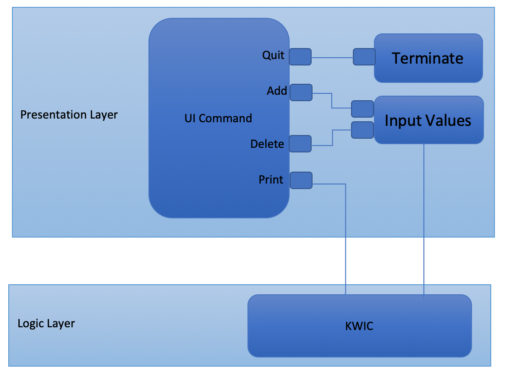

# KWIC System Implementation in C++
The KWIC [Key Word in Context] index system accepts an ordered set of lines, each line is an ordered set of words, and each word is an ordered set of characters. Any line maybe "circularly shifted" by repeatedly removing the first word and appending it at the endof the line. The KWIC index system outputs a list of all circular shifts of all lines in alphabetical order.

# Compilation
To compile sourcecodes, run:
``` 
	make clean 
	make
```

Then, run executable file:
```
	./app
```

# User Interface
This implementation is using CLI (Command Line Interface) which accepts the following key:
1. **a**: Add new text
2. **d**: Delete text
3. **p**: Print list of text by shifts sorting alphabetically
4. **q**: Exit the system

# Circularly Shift Algorithm
Circularly shift algorithm in this KWIC system is using merge sort algorithm. The text is chunked into words and each words are pushed into vector. Circularly shift algorithm shift all words and construct into a string then merge sort algorithm sort all text constructed by circularly shift algorithm alphabetically.

# Architecture
This KWIC System is designed in layer architecture. There are two layers, presentation layer and logic layer. In presentation layer, UI Command will get command from keyboard. The values are added into list and can be deleted from the list. The input then communicates with KWIC from logic layer. KWIC then yield the result.

